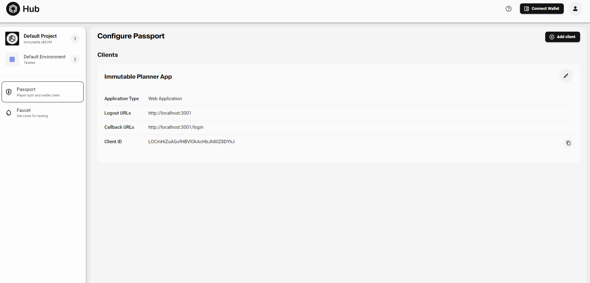

# Immutable Passport Integration

In this guide, I will cover step by step the process of adding immutable passport authentication to an applilcation and creating transactions with it.

Before proceeding, Note that this could be done in plain html/javascript as well as all javascript frameworks including [svelte](https://svelte.dev/), [react](https://react.dev/), [vue](https://vuejs.org/), etc. For this guide, we would make use of [Nextjs](https://nextjs.org).
However, all the core concepts convered here are applicable to all of them.

## Pre-requisites

The follow this guide, ensure you have the following installed

- [npm/nodejs](https://nodejs.org/en)
- A Code Editor

## Getting Started

Run the following commands on your terminal to get started

```bash
git clone https://github.com/Complexlity/immutable-planner-app-starter immutable-planner-app
cd immutable-planner-app
npm install
npm run dev
```

Open <http://localhost:3001> in your browser


You can also find a [Live Example](https://immutable-planner-app-starter.vercel.app/)

## Register You Application On Immutable Hub

In your code editor, go to [.env.example](.env.example)

```.env
NEXT_PUBLIC_LOGOUT_URL=<Your Immutable Hub Logout URL>
NEXT_PUBLIC_CALLBACK_URL=<Your Immutable Hub Redirect URL>
NEXT_PUBLIC_CLIENT_ID=<Your Immutable Hub Client Id>
```

We need these three values to connect

- Logout URL
- Callback URL
- Client Id

Follow the steps below to get the required values

- Go to [hub.immutable.com](https://hub.immutable.com) and create an account. If you're unsure how to do that, Complete this [Quest 3 Guide](https://app.stackup.dev/quest_page/quest-3---create-an-immutable-passport)
- Add A passport Client

- Fill the form provided with the following steps


1. **Application** Type: Web application (remains unchanged). This represents where the application is intented to be run
2. **Client Name**: give your application any name. This is just an identifier.
3. **Logout URLs**: This is very *important*. It represents the url the user is redirected to after they logout of the application (In some applications,the default landing page). E.g <https://your-site-name.com/>
4. **Callback URLs**: Also very *important*. When you try to login, it opens a popup direct to this url. This is where the logging in takes place. E.g <https://your-site-name.com/login>

Click **Create** once you have filled these values.



Copy the three values and replace them in the `.env.example` file

## The Bug Before The Storm

*Very Important*: There's a bug in the sdk where it looks for the `global` and `process`. The `global` and `process` object only exists on Runtimes like Nodejs and not on the browser. To be able to make use of the sdk, you have to import the script below before any other code

```javascript
if (typeof global === 'undefined') {
    window.global = window;
   }

   if (typeof process === 'undefined') {
    window.process = { env: { NODE_ENV: 'production' } };
   }
```

Here we make the `global` object to point to the `window` object on the browser. Also give a value to the `process` object. Without this, the entire process fails

However, For our current project, you can continue with following the steps. The script will be imported much later

## Initialise the Passport object

To have access to immutable authentication, you have to import the necessary function and substitute the values `Logout Url`,  `Callback Uri` and `Client Id`

```javascript
//import the needed functions
import { config, passport, provider } from '@imtbl/sdk';

// Initialize the passport config
const passportConfig = {
  baseConfig: new config.ImmutableConfiguration({
    environment: config.Environment.SANDBOX
  }),
  // This is the client id obtained from the immutable hub
  clientId: process.env.NEXT_PUBLIC_CLIENT_ID,

  // This is the callback url obtained from the immutable hub
  redirectUri: process.env.CALLBACK_URL,

  // This is the logour url obtained from the immutable hub
  logoutRedirectUri: process.env.NEXT_PUBLIC_LOGOUT_URL,
  audience: 'platform_api',
  scope: 'openid offline_access email transact'
};

// Create a new passport instance
const passportInstance = typeof window !== 'undefined' ? new passport.Passport(passportConfig) : undefined

```

`typeof window === undefined`. This is a very important step for bundlers and in our Nextjs use case. This is intended to be run only on the browser so the window object would be undefined on the server

In the root folder of your project, create a folder `store` and create a file `passportStore.js` and copy the file contents below into it

<details>
<summary>store/passportStore.js</summary>
<code>
<pre>
import { createContext, useContext, useState, useEffect } from 'react';
import { config, passport, provider } from '@imtbl/sdk';

const passportConfig = {
  baseConfig: new config.ImmutableConfiguration({
    environment: config.Environment.SANDBOX
  }),
  clientId: process.env.NEXT_PUBLIC_CLIENT_ID,
  redirectUri: process.env.CALLBACK_URL,
  logoutRedirectUri: process.env.NEXT_PUBLIC_LOGOUT_URL,
  audience: 'platform_api',
  scope: 'openid offline_access email transact'
};

const passportInstance = typeof window !== 'undefined' ? new passport.Passport(passportConfig) : undefined

export const MyContext = createContext();

export function MyProvider({ children }) {
  const [passportState] = useState(passportInstance);
  const [providerImx, setProviderImx] = useState(null)

  return (
    `<MyContext.Provider value={{ providerImx, setProviderImx, passportState: passportInstance, }}>`
      {children}
    `</MyContext.Provider>`
  );
}

export function useMyContext() {
  return useContext(MyContext);
}
</pre>
</code>
</details>

Also replace the file contents in [src/pages/_app.js](src/pages/_app.js) with the code below

<details>
  <summary>src/pages/_app.js</summary>
<code>
<pre>
import '@/styles/globals.css'
import "@/styles/App.css";
import "@/styles/styles.css"
import { MyProvider } from '@/store/passportStore'

export default function App({ Component, pageProps }) {
  return(
   `<MyProvider>`
    <Component {...pageProps} />
   `</MyProvider>`
  )
}
</pre>
</code>
</details>

We have created a react context store and put the passport object. This is done so the same passport object is reusable in multiple components (as we would need it). In a different framework, you could as well do something similar though the syntaxes may differ

## Log In User With Passport

After initialising the passport object, we can login by using two methods

1. passportInstance.connectImxSilent();
2. passportInstance.connectImx();

`connectImx` starts the entire login flow from scratch and opens the `Callback Url` in a new mini-window to achieve this while `connectImxSilent` as the name implies does this silently using the tokens generated on previous logins.

The aim of `connectImxSilent` is so the user does not have to go through the entire login process from scratch whenever they reload the page. It just connects *Silently*

In pseudocode, here's how the workflow will be

```pseudocode
try connectImxSilent
if it errors
try connectImx
```

The connectImx displays a popup that opens the `Callback Url` (which we have directed to `/login`. A route that is yet to bet made).
In this route, we would handle the logging in inside the popup and return the data to the home page

```javascript
await passportInstance.loginCallback()
```

This is the single line of code used in the `/login` route and it should be made to be called on page load

- Plain javascript

```javascript
window.addEventlistener('load',() => {
  await passportInstance.loginCallback()
})
```

- React

```javascript
useEffect(() => {
  (async() => {
    await passportInstance.logCallback()
  })()
})
```

- Svelte

```javascript
onMount(async () => {
    await passportInstance.loginCallback()
  });
```

These are some different ways to handle it in different frameworks. The most important thing is to do so on page load

Update [src/components/NavBar.jsx](src/components/NavBar.jsx) to add the login function

<details>
<summary>src/components/NavBar.jsx</summary>
<code>
<pre>
'use client'
import { useMyContext } from "@/store/passportStore";
import Head from "next/head";
import Script from "next/script";
import { useState } from 'react';

export default function NavBar() {
  const { setProviderImx, providerImx ,passportInstance } = useMyContext();
  const [buttonState, setButtonState] = useState('Connect Passport')
  const [isLoading, setIsLoading] = useState(false)

  async function login(
    if (!passportInstance) return
    setButtonState("...Connecting")
    setIsLoading(true)
    let providerImx = await passportInstance.connectImxSilent()
    console.log("provider after silent connect", providerImx);
    if (!providerImx) {
      try {
        console.log("I am connecting now")
        providerImx = await passportInstance.connectImx()
      }
      catch (error) {
        console.log("Something went wrong")
        console.log({ error })
        setButtonState('Connect Passport')
        throw error
      }
      finally {
        setIsLoading(false)
      }
    }
    setProviderImx(providerImx)
    setButtonState('Connected')
    return
  ) {
    return
  }

  async function logout()  {
    return
}

  return (
 `<>`
`<Head>`
        `<title>`Immutable Planner App`</title>`
        `<meta name="description" content="Generated by create next app" />`
        `<meta name="viewport" content="width=device-width, initial-scale=1" />`
        `<link rel="icon" href="/favicon.ico" />`
      `</Head>`
      `<div className="fixed flex justify-end px-4 gap-4 top-0 backdrop-blur-md py-4 w-full">`
             `<button className="text-grey-100 px-4 py-2 opacity-100 rounded-full bg-green-500 hover:bg-green-300" onClick={login}>`
          {buttonState}
        `</button>`
        `</div>`
      `</>`
  );
}
</pre>
</code>
</details>

Create a file in [src/pages/](src/pages/) and call it `login.js`. This is where we would handle the loginCallback(). Also note that this url would match the `Callback Url` we have set in [hub.immutable.com](https://hub.immutable.com) while creating the passport client

<details>
<summary>src/pages/login.js</summary>
</details>

## Getting Logged In User Details

`connectImx` and `connectImxSilent` return a provider object which we have save into the context store as `providerImx`. Contained in the provider object, are wide range of information about the logged in user. Which includes, the tokens, email, eth address, etc

We could get the id token, access token , refresh token, email, and address from the providerImx object by:

```javascript
const idToken = providerImx.user.idToken
const refreshToken = providerImx.user.accessToken
const accessToken = providerImx.user.refreshToken
const userEmail = providerImx.user.profile.email
const ethAddress = providerImx.user.imx.ethAddress
const nickname = providerImx.user.profile.nickname
```

These are some of the values we could get from the provider. There are a lot more. Now we would insert these values on the front end. We would show the user email and eth address on the Navbar while the other details will be shown on the Immutable Widget

Update [src/components/NavBar.jsx](src/components/NavBar.jsx) with the code below

<details>
<summary>src/components/NavBar.jsx</summary>
<code>
<pre>
'use client'

import { useMyContext } from "@/store/passportStore";
import Head from "next/head";
import Script from "next/script";
import { useState } from 'react';

export default function NavBar() {
  const { setProviderImx, providerImx ,passportState: passportInstance, providerZkevm  } = useMyContext();
  const [buttonState, setButtonState] = useState('Connect Passport')
  const [isLoading, setIsLoading] = useState(false)

  async function login() {
    if (!passportInstance) return
    setButtonState("...Connecting")
    setIsLoading(true)
    let providerImx = await passportInstance.connectImxSilent()
    console.log("provider after silent connect", providerImx);
    if (!providerImx) {
      try {
        console.log("I am connecting now")
        providerImx = await passportInstance.connectImx()
        console.log(providerImx)
      }
      catch (error) {
        console.log("Something went wrong")
        console.log({ error })
        setButtonState('Connect Passport')
        throw error
      }
      finally {
        setIsLoading(false)
      }
    }
    setProviderImx(providerImx)
    setButtonState('Connected')
    return
  }

  `return (`
 <>
`<Head>`
        `<title>Immutable Planner App</title>`
        `<meta name="description" content="Generated by create next app" />`
        `<meta name="viewport" content="width=device-width, initial-scale=1" />`
        `<link rel="icon" href="/favicon.ico" />`
      `</Head>`
      `<div className="fixed flex justify-end px-4 gap-4 top-0 backdrop-blur-md py-4   w-full">`
          {
            buttonState === 'Connected'
            ?
            <>
            {providerImx != null
              ?
            <>
              `<p className="px-4 py-2 bg-teal-600 rounded-lg text-gray-200 flex items-center justify-center">{providerImx.user.profile.email} </p>`
                  `<p className="px-4 py-2 bg-teal-600 rounded-lg text-gray-200 flex items-center justify-center">{providerImx.user.imx.ethAddress }</p>`
                </>
                : null
            }
            `<button onClick={logout} className="bg-red-500 text-grey-800 px-4 py-2 opacity-100 rounded-full text-lg  text-gray-100">Logout</button>`
            </>
            : `<button disabled={isLoading} className={`text-grey-100 px-4 py-2 opacity-100 rounded-full "bg-green-500" }`} onClick={login}>`
          {buttonState}
        `</button>`
          }
        `</div>`
      </>
  `);`
`}`
</pre>
</code>
</details>

We're showing the user name and email. Also, we now show the logout button when the user is logged in.

Next, we need to populate the immutable widget with the required data. Update [src/components/widgets/ImmutableWidget.jsx](src/components/widgets/ImmutableWidget.jsx) with the code below

<details>
<summary>src/components/widgets/ImmutableWidget.jsx</summary>
<code>
<pre>
'use client'

import { useMyContext } from "@/store/passportStore";

export default function ImmutableWidget() {
  const { providerImx, passportState: passportInstance  } = useMyContext()

  return (
    `<div style={{ minWidth: 300, maxWidth: 500 }}>`
      `<div style={{display: "flex",justifyContent: "space-between",alignItems: "row",}}>`
        `<p style={{color: "white",fontSize: "24px"}}>Immutable</p>`
      `</div>`
      `<div`
        `className="tokens">`
        `{/* User Data Goes Here*/}`
        `<details><summary>Id Token</summary>{providerImx?.user.idToken ?? ""}</details>`
        `<details><summary>Access Token</summary>{providerImx?.user.accessToken ?? ""}</details>`
        `<details><summary>Refresh Token</summary>{providerImx?.user.refreshToken ?? ""}</details>`
        `<details><summary>Nickname</summary>{providerImx?.user.profile.nickname ?? "User has no nickname"}</details>`
        `{/* Rpc function go here */}`
      `</div>`
    `</div>`
  );
}
</pre>
</code>
</details>

## Log Out A User

The `passportInstance` comes with a `logout` function which when called, logs the user out and redirect the page to the `Logout URLs` we specified while creating the passport client in [hub.immutable.com](https://hub.immutable.com)

Call `passportInstance.logout` in [src/components/NavBar.jsx](src/components/NavBar.jsx)

<details>
<summary>src/components/NavBar.jsx</summary>
....Rest of the code
async function logout()  {
  // Logout Function Go Here
    await passportInstance.logout();
    setButtonState('Connect Passport')
}
...Restof the code
</details>

And that's it. We are now able to login and logout the user.

## Initiating A Transaction From Passport

To call the EVM RPC functions, we need to create a `Zkevm Provider`. All through, we have used the `Imx Provider`

```javascript
const providerZkevm = passportInstance.connectEvm()
```

`providerZkevm` returns an object which could be used to interact with the ethereum chain. Here are some example functions

- 
